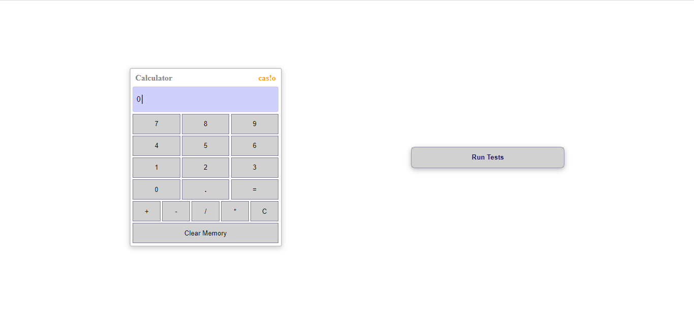

# Calculator Project

A simple calculator web application built using HTML, CSS, and JavaScript. This calculator comes with some unique features to enhance user experience and privacy.

## Features

### 1. Memory Cache

The calculator includes a memory cache that can store up to 10 frequently accessed expressions. This allows users to quickly retrieve and reuse previously entered calculations without having to retype them.

### 2. No Usage of `eval()`

Unlike some calculators, this project does not utilize the `eval()` function, ensuring better security and preventing potential vulnerabilities that might arise from executing arbitrary code.

## Demo

 [See the live demo](https://calculator-by-fred.netlify.app/)

## Getting Started

1. Clone the repository: `git clone https://github.com/FREDRICKKYEKI/calculator_js.git`
2. Open `index.html` in your web browser.
3. Start performing calculations!

## Usage

1. Enter expressions using the calculator's interface.
2. Click up or down key on the keyboard to access cache to retrieve and reuse cached expressions.
3. Enjoy secure and efficient calculations without the use of `eval()`.
4. Feel free to run the tests that I used to ensure the calculator works efficiently.

## Contributing

Contributions are welcome! If you find any issues or would like to add new features, feel free to fork the repository and submit a pull request.

## Technologies Used

- HTML
- CSS
- JavaScript

## Author
[FREDRICKKYEKI](https://github.com/FREDRICKKYEKI)

## License

This project is licensed under the [MIT License](./LICENSE).
